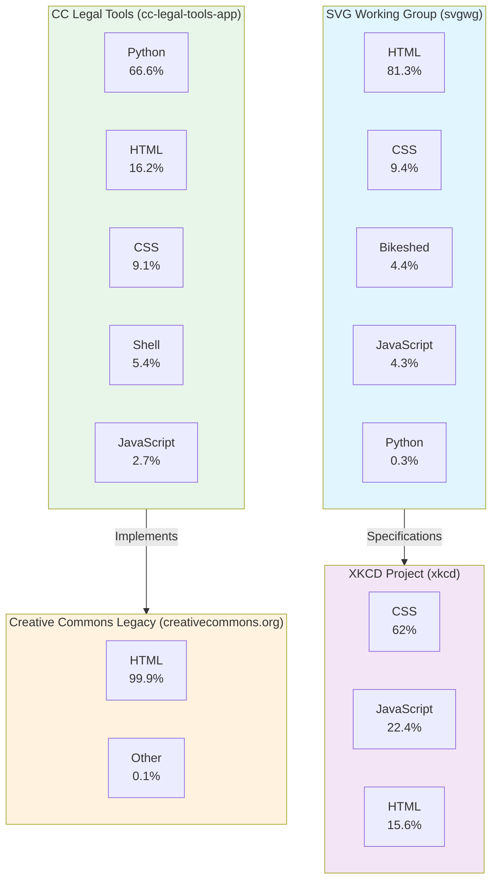

# Architecture Overview

This document provides a visual overview of the repository ecosystem and technology composition.

## Repository Architecture

## Technology Stack by Repository

### SVG Working Group (svgwg)
- **Primary Language**: HTML (81.3%) - Specification documents
- **Styling**: CSS (9.4%)
- **Documentation**: Bikeshed (4.4%) - Specification format
- **Scripting**: JavaScript (4.3%)
- **Build Tools**: Python (0.3%), Makefile (0.1%)
- **Description**: SVG Working Group specifications

### XKCD Project (xkcd)
- **Primary Language**: CSS (62%) - Styling focus
- **Interactivity**: JavaScript (22.4%)
- **Markup**: HTML (15.6%)

### CC Legal Tools Application (cc-legal-tools-app)
- **Primary Language**: Python (66.6%) - Backend
- **Markup**: HTML (16.2%)
- **Styling**: CSS (9.1%)
- **Build/Deploy**: Shell (5.4%)
- **Client-side**: JavaScript (2.7%)
- **Description**: Legal tool (licenses, public domain dedication, etc.) management application for Creative Commons

### Creative Commons Legacy (creativecommons.org)
- **Primary Language**: HTML (99.9%) - Static/legacy content
- **Other**: (0.1%)
- **Description**: Legacy legal code translations and general support issues

## Key Insights

1. **SVG Working Group** is documentation-heavy with Bikeshed specifications
2. **XKCD Project** emphasizes frontend styling and interactivity
3. **CC Legal Tools** is a full-stack application with Python backend
4. **Creative Commons Legacy** is a static HTML-based repository for historical content
